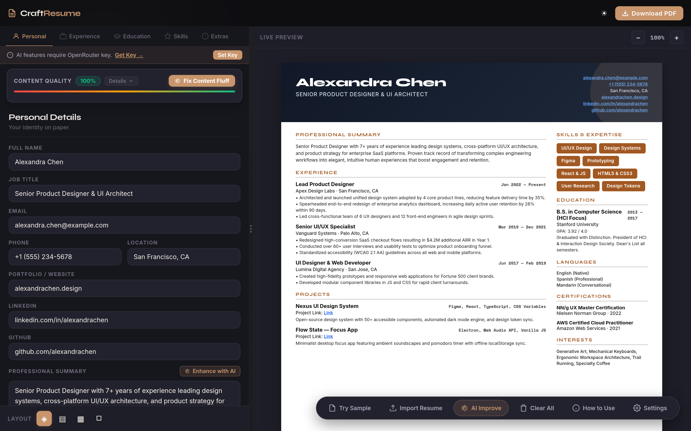
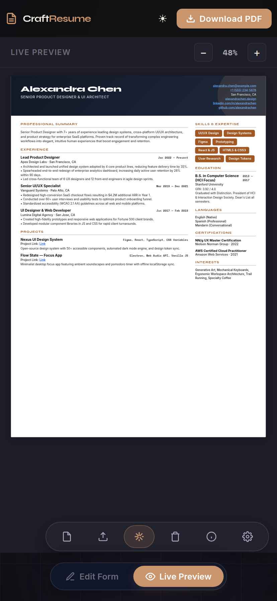

# ⬡ CraftResume — Editorial Resume Builder

> Craft stunning, ATS-optimized, single-page A4 resumes in real-time with zero dependencies. Built with pure HTML5, CSS3, and JavaScript ES6+.

---

## 📸 Screenshots

### 💻 Desktop Editor & Real-Time A4 Live Preview


---

### 📱 Mobile View & Responsive Layout Switcher


---

## ✨ Key Features

- **📄 4 Editorial A4 Print Layouts**:
  - **Modern (◈)**: Dual-column terracotta & ink design.
  - **Classic (▤)**: Centered traditional layout for academic & corporate roles.
  - **Compact (▦)**: High-density layout tailored for experienced professionals.
  - **Minimal (◻)**: Clean typography-focused editorial preset.
- **🖨 Perfect A4 PDF Export**:
  - Hardened `@media print` engine formatted precisely for single-page `210mm x 297mm` A4 output without bottom text clipping.
- **📱 Fully Responsive (PC & Mobile)**:
  - Floating mobile bottom switcher (`[ ✎ Edit Form | 👁 Live Preview ]`).
  - Auto-scaling paper preview engine for small mobile screens down to 360px.
  - Touch-friendly 100% full-width input controls on mobile devices.
- **✍ Auto-Expanding Description Fields**:
  - Textarea fields (Summary, Experience, Education, Projects, Interests) automatically grow with content height without vertical scrollbars.
- **🏷 Skill Hierarchy & Proficiency System**:
  - Color-coded proficiency tags (`Expert`, `Advanced`, `Intermediate`, `Beginner`) in both editor and live preview.
- **⚡ Instant Demo Data Loader**:
  - 1-click sample data loading to instantly preview all fields and templates.
- **🌗 Theme Toggle**:
  - Sleek dark and light glassmorphic interface.

---

## 🛠 Tech Stack

- **HTML5**: Semantic markup with dynamic module rails.
- **CSS3**: Modern CSS variables, glassmorphism, flexbox/grid, and print media queries.
- **JavaScript (ES6+)**: Zero framework runtime, DOM state management, local storage persistence.

---

## 🚀 Getting Started

Simply clone the repository and open `index.html` in any web browser:

```bash
# Clone the repository
git clone git@github.com:Abhimanyu012/build_resume.git

# Navigate into project directory
cd build_resume

# Open index.html directly or serve using local server
npx serve .
```

---

## 📄 License

MIT License — Free to use and customize.
